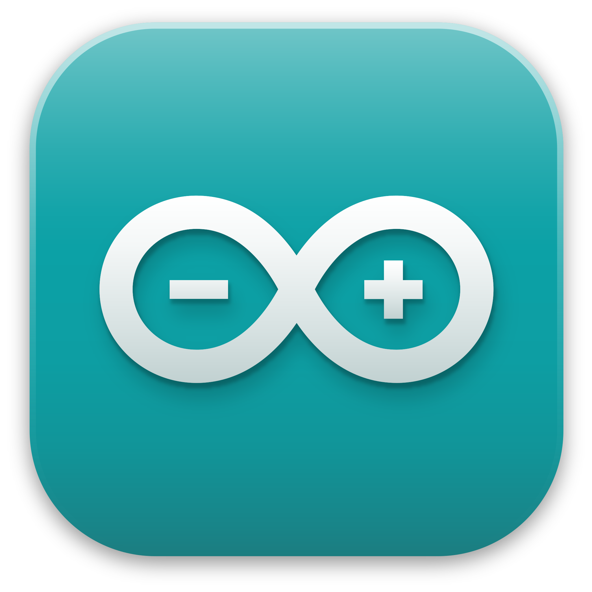

# SportShield Team 8

**SportShield** is an innovative anti-theft device designed for sports equipment, equipped with sensors and actuators to detect movement, activate an alarm, and notify the owner. \
It has been designed by Coris Innovation.

As a subcontractor, our team has been charged with the improvement of the device's software. \
Our focus will be on:
- 🔋 Battery consumption and lifespan
- 💳 Implement NFC lock/unlock
- 🚨 Alarm management

## Technologies used

**SportShield** is a mix of 2 main technologies: 
-  C and  C++ for the software development
-  The Arduino framework for the hardware development.

## Important Links and Docs

- [Project Charter](./documents/projectCharter.md)
- [Functional Specifications](./documents/functionalSpecifications/functionalSpecifications.md)
- [User Guide](./documents/userGuide.pdf)
- [Technical Specifications](./documents/technicalSpecifications/technicalSpecifications.md)
- [Test Plan](./documents/qualityAssurance/testPlan.md)
- [Management Walkthrough](./documents/management/managementWalkthrough.md)

## Contributors

| **Photo** | **Name** | **Role** | **GitHub/LinkedIn** |
|---|---|---|---|
| | CLÉMENT Quentin | Project Manager | [GitHub](https://github.com/Quentin-Clement) \| [LinkedIn](https://www.linkedin.com/in/quentin-cl%C3%A9ment-939110221/) |
| | THIZEAU Maxime | Program Manager | [GitHub](https://github.com/MaximeTAlgosup) \| [LinkedIn](https://www.linkedin.com/in/maxime-thizeau-0b311a293/) |
| | LEROY Victor | Tech Writer | [GitHub](https://github.com/Victor-Leroy) \| [LinkedIn](https://www.linkedin.com/in/victor-leroy-64baa3229/) |
| | BERNARD Max | Tech Lead | [GitHub](https://github.com/maxbernard3) \| [LinkedIn](https://www.linkedin.com/in/max-bernard-b77680210/) |
| | PLANCHARD Thomas | Software Engineer | [GitHub](https://github.com/thomas-planchard) \| [LinkedIn](https://linkedin.com/in/thomas-planchard-461782221/) |
| | MARLIER Thibaud | Quality Assurance | [GitHub](https://github.com/Biohazardyee) \| [LinkedIn](https://www.linkedin.com/in/thibaud-marlier/) |
