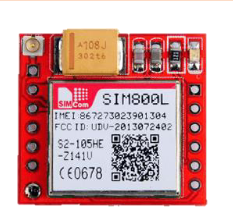

<h1 align="center"> SportShield - Functional specifications </h1>

Created by: Maxime THIZEAU   Creation Date: 11/03/2024   Last update: 18/03/2024

___

This project was requested by [ALGOSUP](https://algosup.com), a French computer science school, in partnership with [CORIS Innovation](https://www.corisinnovation.com/), a French consulting firm.

This project aims to complete and optimise the existing **software**[^1] given by **CORIS Innovation**[^2].

<b>📖 Table of Contents</b>

- [1. Project Overview 🔎](#1-project-overview-)
  - [1.1. Stakeholders](#11-stakeholders)
    - [➭ **Project Members**](#-project-members)
    - [➭ **Other Stakeholders**](#-other-stakeholders)
  - [1.2. Project Scope](#12-project-scope)
  - [1.3. Out Of Scope](#13-out-of-scope)
    - [➭ **Application Improvement**](#-application-improvement)
    - [➭ **Market Analysis**](#-market-analysis)
    - [➭ **Refurbish Hardware**](#-refurbish-hardware)
  - [1.4. Timeline](#14-timeline)
  - [1.5. Deliverables And Milestones](#15-deliverables-and-milestones)
  - [1.6. Budget](#16-budget)
    - [➭ **Hardware**](#-hardware)
- [2. Evaluation Framework 📈](#2-evaluation-framework-)
  - [2.1. Evaluation Criteria](#21-evaluation-criteria)
    - [➭ **Acceptance Criteria**](#-acceptance-criteria)
    - [➭ **Performance Requirements**](#-performance-requirements)
  - [2.2. Risks And Assumptions](#22-risks-and-assumptions)
    - [➭ **Risks**](#-risks)
    - [➭ **Assumptions**](#-assumptions)
- [3. Personas And Use Cases](#3-personas-and-use-cases)
  - [3.1. Persona 1 - Georges Michael ⛷️](#31-persona-1---georges-michael-️)
  - [3.2. Persona 2 - Jane Hamilton 🏂🏽](#32-persona-2---jane-hamilton-)
  - [3.3. Persona 3 - Patrick Broussard ♨](#33-persona-3---patrick-broussard-)
- [4. Functional Requirements ✔](#4-functional-requirements-)
  - [4.1. Battery Consumption](#41-battery-consumption)
    - [➭ **Modes**](#-modes)
    - [➭ **LED Implementation**](#-led-implementation)
    - [➭ **Low Battery Management**](#-low-battery-management)
    - [➭ **Notifications**](#-notifications)
  - [4.2. GPRS Management](#42-gprs-management)
  - [4.3. Motion Detection](#43-motion-detection)
  - [4.4. Bluetooth](#44-bluetooth)
  - [4.5. NFC](#45-nfc)
    - [➭ **Alarm Turning Off**](#-alarm-turning-off)
    - [➭ **Device Unlocking**](#-device-unlocking)
- [5. Future Improvements 🚀](#5-future-improvements-)
  - [5.1. Battery Consumption](#51-battery-consumption)
  - [5.2. Pass And Pairing](#52-pass-and-pairing)
  - [5.3. Changing Phone](#53-changing-phone)
- [6. Glossary 📓](#6-glossary-)

## 1. Project Overview 🔎

### 1.1. Stakeholders

#### ➭ **Project Members**

| Full Name        | Occupation               | Links                                                               |
| ---------------- | ------------------------ | ------------------------------------------------------------------- |
| Quentin CLEMENT  | Project manager          | [LinkedIn](https://linkedin.com/in/quentin-cl%C3%A9ment-939110221/) |
| Maxime THIZEAU   | Program manager          | [LinkedIn](https://linkedin.com/in/maxime-thizeau-0b311a293)        |
| Max BERNARD      | Tech lead                | [LinkedIn](https://linkedin.com/in/max-bernard-b77680210)           |
| Thomas PLANCHARD | Senior software engineer | [LinkedIn](https://linkedin.com/in/thomas-planchard-461782221/)     |
| Thibaud MARLIER  | Quality assurance        | [LinkedIn](https://linkedin.com/in/thibaud-marlier/)                |
| Victor LEROY     | Technical writer         | [LinkedIn](https://linkedin.com/in/victor-leroy-64baa3229/)         |

#### ➭ **Other Stakeholders**

|Name              | Representative | Occupation                                 | Links                                            |
| ---------------- | -------------- | ------------------------------------------ | ------------------------------------------------ |
| CORIS Innovation | Florent ANON   | Client (Head of the Innovation Department) | [LinkedIn](https://linkedin.com/in/florentanon/) |
| ALGOSUP          | Franck JEANNIN | Third party                                | [Website](https://algosup.com)                   |

### 1.2. Project Scope

This project is more of a maintenance project because we aren't starting from scratch.

Our team is retrieving an actual project from CORIS Innovation. \
It is called SportShield and it is a device capable of securing your skis or snowboard by roping them with the device. \
The device is composed of an alarm, a **motion detector**[^3], a **GPS**[^4], a cable, an **electromagnet**[^5], a small **Bluetooth**[^6] antenna and a **programmable card**[^7]. It is also provided with an application to change mode and get notifications in real-time of the device. \
In the end, this device is meant to be used in other sports fields such as bicycle or skateboard.

As a matter of fact, the team was asked to optimise an existing code of the product given by CORIS Innovation but also to add more features such as the **NFC**[^8].

All these improvements should be done within the deadlines set by the school and respecting the criteria of battery consumption which is important but also the expected requirements given by the company.

### 1.3. Out Of Scope

This project also has some features that could be implemented but are not in our area of expertise and are not feasible within the time given to us by the school for the SportShield project.

#### ➭ **Application Improvement**

The application software is not in its final state and could be improved in many ways. \
However, the team was specially asked to only work on the product's software which doesn't include the application. It will be done by the client's company and not by the school's team.

#### ➭ **Market Analysis**

The market analysis is not to be defined, it was already done by the client company. \
Moreover, a market analysis wouldn't make any sense there.

#### ➭ **Refurbish Hardware**

The **hardware**[^9] should be refurbished as it does not exactly correspond to the project. We have found out that the hardware doesn't work as intended, as the product is a prototype, it is no surprise to us. It poses some problems in a lot of aspects and is not optimal. Meaning, that we are quite limited by the hardware and its flaws. \
For example, the electro-magnet consumes way too much energy for the battery and can not be deactivated with the actual layout. \
However, the team was precisely asked to focus only on the software, the research and purchase of better hardware are consequently not our task.

### 1.4. Timeline

| Main Subjects                 | Time allocated (These are not up-to-date as our schedule is not complete yet) | Description                                                                     |
|-------------------------------|-------------------------------------------------------------------------------|---------------------------------------------------------------------------------|
| Planning and Research         | 1 week 5 half days                                                         | Learning about the project and preparing it.                                    |
| Adding Features               | week 2 to 4 10 half days                                                   | Adding the NFC, the different levels of noise.                                  |
| Tests                         | week 3 to 5  5 half days                                                   | Creating the test strategy, Doing the Test cases, Fixing them.            |
| Optimisation                  | week 5 2 half days                                                         | Reducing the battery consumption as much as possible.                           |
| Pitch and Support Preparation | week 6 3 half days                                                         | Preparing the final presentation to the client and providing the final product. |

The complete timeline and tasks can be found in the [Roadmap](https://github.com/orgs/algosup/projects/24/views/6) in the GitHub project.

### 1.5. Deliverables And Milestones

| Date And Time       | Deliverables             |
| --------------------| ------------------------ |
| 18 March 2024, 5 PM | Functional Specifications|
| 26 March 2024, 5 PM | Technical Specifications |
| 30 March 2024, 5 PM | **MVP**[^10]             |
| 10 April 2024, 5 PM | Test Plan                |
| 10 April 2024, 5 PM | User Manual              |
| 10 April 2024, 5 PM | Final Product            |
| 19 April 2024, 9 AM | Oral Presentation        |

### 1.6. Budget

In terms of budget, no budget has been set by the client nor by the team. However, we should keep in mind that the hardware is fragile. We could probably break hardware unintentionally, but it would be our responsibility. It can burn in many ways, get broken etc... \
Moreover, the project can be impeded by the hardware limitation of the product. We will be giving suggestions to the client to improve the hardware if we think it is needed for the project's well-being. \
There is no budget set, but some expenses could happen in the future. It should be kept in mind.

#### ➭ **Hardware**

This section goes down the various **modules**[^11] and electronics that the client has provided to us. It doesn't directly enter into the budget of the team, but might if any of those breaks down.

| Hardware                | Details                                                                                 | Picture |
|-------------------------|-----------------------------------------------------------------------------------------|---------|
| Xiao BLE Sense nrf52840 | Small Bluetooth programmable card with a built-in antenna.    Bluetooth Low Energy.  | |
| GNSS PA1010D            | GPS Module with a built-in antenna.   Gives real-time location.   **Power Supply:** VCC：3.0V to 4.3V；VBACKUP：2.0V to 4.3V,    **Consumption:** Acquisition: 36mA, Tracking: 28mA                      ||
| GSM/2G SIM800L Module   | Mini GSM Module.   Provides 2G data.                                                 ||
| 1NCE SIM Card           | Multi-network and multi-mode SIM card.                                               ||
| Electromagnet           | Is used to unlock the device.                                                           ||
| Piezoelectric buzzer    | Buzzer with an oscillator control circuit.                                                 ||
| Lithium-Polymer battery | A 3.7V, 1100mAh, 4.1Wh Lithium-Polymer powered battery. It has an estimated lifespan of around 300 to 500 charge cycles.|
| NFC Antenna             | NFC module. Provides NFC compatibility.                                                 ||

## 2. Evaluation Framework 📈

### 2.1. Evaluation Criteria

The evaluation criteria are set principally by the stakeholders, they are the ones that will assess whether the product fulfils expectations or not.

#### ➭ **Acceptance Criteria**

The product will be accepted only if all the requirements given by the client are fulfilled by our team. \
The main requirements according to the document given by the client are:

- Battery consumption management: at least 7 days of battery without recharging;
- Device management with NFC: unlock/lock the device with NFC;
- Alarm Management and simultaneous actions: stop the alarm when it rings, even if the cycle isn't finished. Ring and send information to the server at the same time;
- Security improvements: prevent the battery from running out while the product is in use, LED to show the battery state, lock the device when it runs out of battery.

#### ➭ **Performance Requirements**

The product needs to be more efficient than it was before in terms of energy consumption. Our team discovered ways to improve the overall performance of the product, such ways are:

- Battery management;
- Run-time optimization (code optimization);
- NFC (being less energy-consuming than Bluetooth).

### 2.2. Risks And Assumptions

#### ➭ **Risks**

The main risks are related to the hardware part of the project, but the team is also worried about the software aspect. It's our job to address these concerns and find solutions.

The risks are the following:

*➭ Communication Issues*

- Impact:
  - Having communication issues with the client could fetch a misunderstanding and consequently a final code and product not suitable to the client's requirements and needs.
- Solution:
  - Having constant and regular communication with the client by mail exchange for example. Another solution to avoid these issues is to have regular meetings, they are more difficult to organise but allow a better exchange between the two sides.

*➭ 2G Shutdown*

- Impact:
  - A 2G shutdown would break an enormous part of the project whereas all the notifications pass by this system. In other words, a 2G shutdown would break the main utility of the application if the skis are being robbed.
- Solution:
  - There is no real solution to avoid the 2G shutdown. However, we can think about changing the 2G to the most recent version, like 3G, and the module linked to it.

*➭ Board Breaking*

- Impact:
  - A board breaking would be the worst scenario for us considering that no other board would be provided by the school.
- Solution:
  - Be careful with the board and avoid breaking or burning it at all costs. Either way, the best choice would be to borrow some hardware from the other teams but it would imply having less testing time on the hardware. The other choice would be to purchase a new board, which brings another issue: the delivery time.

*➭ Delivery Time*

- Impact:
  - In case the team wanted new hardware modules and considering the delivery time and the short amount of time for this project, they would probably not arrive in time.
- Solution:
  - The best solution would be to order them earlier during the project or to simply avoid breaking anything.

#### ➭ **Assumptions**

During this project, we would assume:

- The 2G works as expected as CORIS Innovation told us because we will not be able to test it in our environment.
- The 2G network would not be shut down during the project.
- No extra material would be needed since it was provided by the client and the school.
- The Bluetooth can be connected to the application as expected, we can not check it since we have no access to the application.
- The NFC device would not cease to function.
- We assume that ALGOSUP will allocate us enough time to work on the project.

## 3. Personas And Use Cases

### 3.1. Persona 1 - Georges Michael ⛷️

### 3.2. Persona 2 - Jane Hamilton 🏂🏽

### 3.3. Persona 3 - Patrick Broussard ♨

## 4. Functional Requirements ✔

The main requirements for this project are:

- Optimise the actual code;
- Add a feature for the NFC;
- Check the buzzer's noise level according to the impact;
- Managing the battery consumption so it can last 7 days in cold conditions (6 hours of active mode and 18 in sleep mode).

### 4.1. Battery Consumption

#### ➭ **Modes**

Four different modes are being set for the device:

- The first mode is the locked mode, which will turn on the motion detector, the NFC and the Bluetooth, other modules could be activated depending on the situation such as the alarm if an impact has been detected;
- The second one is the unlocked mode, which consists of switching on only the Bluetooth and the NFC, allowing us to economise energy in the battery;
- The third one is called the trigger mode, which is the mode when the alarm is ringing. Depending on the kind of shock it will ring differently. At the end of the ringings, it will turn the locked mode again.
  - For a small shock, it will last 10 seconds, 0.1 second each ringing separated by 2 seconds;
  - For a big shock, it will last 10 seconds, 0.1 second each ringing separated by 0.5 seconds;
- Finally, we would have the sleep mode which will be used when you don't need to use the device. \
When using this mode, the motion sensor will be turned off as well as the alarm, only the NFC would be activated.

| Mode         | Pros       | Cons |
|--------------|----------------------------------------------------------------------------------------------------------------------------------------------------|---------------------------------------------------------------------------------------------------------|
| Locked Mode:   | Safest mode available, provides detection of shocks and break-in alerts.   NFC and Bluetooth are activated for the user to connect to the device.  | The most consuming mode (less consuming than the actual active mode which was provided by the client).  |
| Unlocked Mode: | Capable of changing mode by the NFC and Bluetooth, allowing to change mode with the application.                                               | Consume more than the sleep mode.                                                                       |
| Trigger Mode:| Disuasive | Make a lot of noises |
| Sleep Mode:  | The less consuming mode of the three. Activates only the NFC to switch the device on.                                                              | This mode only exists since there is no button to turn on/off the device.                               |

#### ➭ **LED Implementation**

However, consideration has been given to incorporating a small light at the bottom of the device to provide visual information regarding the battery level. It would be set like this:

- The LED is green if the battery level is above 60%;
- The LED is orange when the battery consumption lies between 59 and 20%;
- The LED is red when the battery is under 20%.

| Pros       | Cons |
----------------------------------------------------------------------------------------------------------------------------------------------------|---------------------------------------------------------------------------------------------------------|
| The user will be able to know the battery level without having to open the application. | The LED will consume energy, however, it is negligible as LEDs do not consume a lot. |

#### ➭ **Low Battery Management**

Additionally, a further security measure is being implemented in the device by:

- implementing a sonorous signal when the battery state is at 15%, to notify the user the battery state is critically low;
- sending a notification informing of the state of the device.
The sound would also become more frequent when the battery level is under 5%, there will be a sound of 0.5 seconds separated by 0.5 seconds of blank.

| Pros       | Cons |
----------------------------------------------------------------------------------------------------------------------------------------------------|---------------------------------------------------------------------------------------------------------|
| The user will be informed of the battery level. | The buzzer will consume energy. |

#### ➭ **Notifications**

The fifteen-minute notifications during the actual sleeping mode have been estimated as too high and irrelevant. \
However, two kinds of notification will be set. One for the battery level, a critical notification will be sent whenever the device reaches a battery level of about 15%. \
A notification will be sent to the user, whenever the device is unlocked/locked using NFC, giving the battery level and current mode. \
Another for impact detection, if an impact has been detected, a notification will be sent to the user, providing the information a break-in attempt is ongoing.

| Pros       | Cons |
|-------------------------------------------------|----------------------------------------|
| The user will be informed of the battery level. | The frequency of the notifications can be annoying. |

### 4.2. GPRS Management

The decision was made to change the notifications sent by the **GPRS**[^12]. Henceforth, they will contain:

- The current mode of the device (trigger, lock, unlock and sleep);
- The battery level;
- The state of the device (locked or unlocked).
- The device's location

| Pros       | Cons |
|-------------------------------------------------|----------------------------------------|
| The user will get useful information about the device. | The notifications will consume energy. |

### 4.3. Motion Detection

Motion detection has been considered too sensitive and would then be improved in a way that parasite movements such as the wind should not be detected as motion and then not activate the alarm system. \
To be more precise, all the motion detected by the hardware under 5 mm/s for the translations and under 10 deg/s for the rotation would be considered a parasite and not activate the alarm. \
Regarding the important impact, they would be detected above 10 mm/s for the translation and 20 deg/s for the rotation.

| Pros       | Cons |
|-------------------------------------------------|----------------------------------------|
| The product won't be too sensitive to parasite movement.  Offers precise and effective shock detection. | May reduce the current KPIs shock and motion detection given by the client (if we change this, we need to be as efficient as the previous product). |

### 4.4. Bluetooth

It has been decided to reduce the Bluetooth range of the device to reduce battery consumption. The team has set this range to 3 meters.

| Pros       | Cons |
|-----------------------------------------|----------------------------------------|
| Consumes less energy. | Can't connect to the device while walking to the device. |

### 4.5. NFC

#### ➭ **Alarm Turning Off**

It has been found relevant to implement a system to cut the alarm using NFC with a card or a badge and not necessarily the application. \
It would be quicker to stop the alarm than to take the phone, open the application and deactivate the alarm.

| Pros       | Cons |
|-------------------------------------------------|----------------------------------------|
| Allows to deactivate the alarm without waiting for the end of the cycle. | If someone robs the card/badge, can deactivate the device. |

#### ➭ **Device Unlocking**

It has been decided to implement an unlocking feature using NFC. After pressing the NFC against the device for two seconds it would unlock it. \
Moreover, this feature will override the previous one. In the case of an alarm ringing it could stop the alarm and unlock the device if you press the NFC against the sensor for two seconds.

| Pros       | Cons |
|-------------------------------------------------|----------------------------------------|
| Quicker to deactivate with a card.   Allows different ways to deactivate the same device.   You can leave your phone at home and still deactivate the device. | If someone robs the card/badge, can unlock the device. |

## 5. Future Improvements 🚀

Considering the short amount of time given and the important amount of tasks and requirements the project has. It has been decided to postpone some of them, deemed non-critical to the completion of the SportShield project in the short term. \
However, these tasks have been planned to be done as future improvements in the long term.

### 5.1. Battery Consumption

One of the requirements given by the company was to use the battery only between 20 and 80%. \
Estimating Apple's battery management with the intelligent battery system, consisted of charging just before the average time usage and stopping it at 80%. \
The team thought it was what the device needed. \
However, considering the difficulty of the task and the amount of time, it has been decided to do it later on.

### 5.2. Pass And Pairing

Searching for an improvement of the system and optimisation, it has been agreed to implement a system pass with the ski stations or the feature of pairing more than one device at a time such as badges for example. \
This system would be implemented in a brief delay after the release of the product as an update.

### 5.3. Changing Phone

One issue stood out, the pairing of the phone if it has to be changed.
A feature would be added, comporting an option to unpair the actual device and could only be activated on the application if the Bluetooth is activated (locked and unlocked modes only).

## 6. Glossary 📓

[^1]: **Software**: a collection of instructions, data, or programs used to operate computers and perform specific tasks. It encompasses all the programs, applications, and operating systems that run on computers and other digital devices.

[^2]: **CORIS Innovation**: a European company based in France and Switzerland. The company focuses on systems engineering and process engineering. Their ambition is to support European industrial players in their innovation,  R&D, digitalization and production challenges. [CORIS Innovation's website](https://www.corisinnovation.com)

[^3]: **Motion Detector**: is an electronic device that is designed to detect and measure movement. Motion sensors can be customized to perform highly specific functions. For example, motion sensors can be used to activate floodlights, trigger audible alarms, activate switches, and even alert the police. [Motion Detector](https://www.fierceelectronics.com/sensors/what-a-motion-sensor)

[^4]: **GPS**: Global Positioning System (GPS), is a satellite-based radio navigation system owned by the United States government. It is a satellite constellation supporting highly accurate positioning, navigation and timing (PNT) measurements worldwide. [GPS](https://novatel.com/support/knowledge-and-learning/what-is-gps-gnss)

[^5]: **Electromagnet**: a type of magnet in which the magnetic field is produced by the flow of electric current. Unlike permanent magnets, which generate a constant magnetic field, electromagnets can be turned on and off by controlling the flow of electricity to them. Electromagnets are widely used in various applications where the ability to control the magnetic field is important.

[^6]: **Bluetooth**: is a short-range wireless technology standard that is used for exchanging data between fixed and mobile devices over short distances. It is mainly used as an alternative to wired connections to exchange files between nearby portable devices and connect cell phones and music players with wireless headphones. [Bluetooth](https://en.wikipedia.org/wiki/Bluetooth)

[^7]: **Programmable card**: a small electronic device that is capable of being programmed to perform various functions or tasks.

[^8]: **NFC**: which stands for Near Field Communication, is a set of short-range wireless technologies. It lets you share small payloads of data between an NFC tag and an Android-powered device. It can rapidly establish a connection, taking only one-tenth of the time Bluetooth requires to complete pairing.

[^9]: **Hardware**: the machines, wiring, and other physical components of a computer or other electronic system. The physical and electronic parts of a computer or other piece of equipment, rather than its software. [Definition](https://dictionary.cambridge.org/dictionary/english/hardware)

[^10]: **MVP**: minimum viable product is a version of a product with just enough features to be usable by early customers who can then provide feedback for future product development.

[^11]: **Modules**: A module is an assembly of parts designed to be added and removed from a larger system easily. In this project, modules are for instance: the battery, the buzzer, the NFC scanner etc. [Modules](https://www.techtarget.com/whatis/definition/module#:~:text=A%20module%20is%20a%20distinct,is%20designed%20for%20easy%20replacement.)

[^12]: **GPRS**: abbreviation for general packet radio service: a system for sending and receiving images and other information using mobile phones. It makes for good battery life but limits online activity.  It is a packet-oriented mobile data standard on the 2G cellular communication network's global system for mobile communications.
